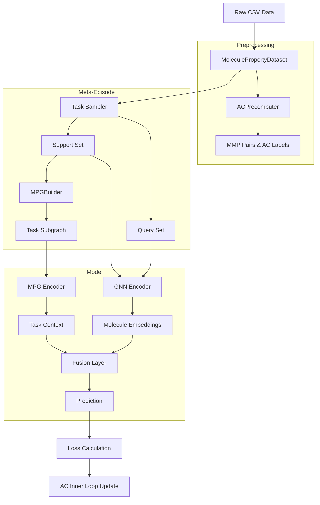

# Project Learning Guide & Documentation

This document provides a comprehensive overview of the **AC-Aware Meta-Learning for Molecular Property Prediction** project. It is designed to help you understand the codebase, the algorithms implemented, and how to extend the project.

## 1. Project Overview
This project implements a meta-learning framework (specifically GS-Meta with Activity Cliff awareness) to predict molecular properties in low-data regimes (Few-Shot Learning).

**Key Concepts:**
*   **Meta-Learning:** Learning to learn. The model trains on many "tasks" (properties) so it can quickly adapt to a new property with few samples.
*   **Activity Cliff (AC):** Pairs of molecules with high structural similarity but drastically different properties. These are "hard examples" that the model focuses on.
*   **Molecule-Property Graph (MPG):** A heterogeneous graph connecting molecules and properties, providing context for the learning task.

## 2. File Manifest & Structure

### Configuration (`configs/`)
*   `datasets.yaml`: Dataset paths and split settings (Meta-Train/Val/Test).
*   `model_base.yaml`: Common hyperparameters (GNN layers, hidden dims, learning rates).
*   `exp_*.yaml`: Specific configurations for different experiments (Baselines, AC-Inner, Full).

### Data Pipeline (`src/data/`)
*   `datasets.py`: **Core Data Loader**. Handles CSV reading, property splitting, and **Task Sampling** (`sample_task`).
*   `featurization.py`: Converts SMILES strings to PyTorch Geometric graphs with rich atom/bond features.
*   `ac_precompute.py`: **Preprocessing**. Mines Matched Molecular Pairs (MMP) and identifies Activity Cliffs (AC) using Tanimoto similarity.
*   `mpg_builder.py`: **Graph Construction**. Builds the heterogeneous Molecule-Property Graph (MPG) and extracts task-specific subgraphs for each episode.

### Models (`src/models/`)
*   `gnn_encoder.py`: **Backbone**. A GNN (GIN/GCN) that encodes a molecular graph into a vector embedding.
*   `mpg_encoder.py`: **Context Encoder**. A Heterogeneous GNN that processes the MPG to generate "Task Embeddings".
*   `gsmeta_core.py`: **Main Model**. Orchestrates the GNN encoder and MPG encoder. Fuses molecular embeddings with task context.
*   `ac_inner_loop.py`: **Optimization**. Implements the inner-loop adaptation logic (gradient updates), potentially weighted by AC importance.
*   `ac_scheduler.py`: Controls how much weight AC tasks get during training over time.

### Training & Experiments (`src/training/`, `src/experiments/`)
*   `loops.py`: **Training Logic**. Contains `meta_train_loop` which handles task sampling, batch preparation, inner-loop adaptation, and outer-loop optimization.
*   `train_meta.py`: **Entry Point**. Parses args, loads config, and starts the loop.
*   `run_*.py`: Wrapper scripts for specific experiment configurations.

## 3. Data Flow & Architecture



## 4. Key Algorithms Deep Dive

### A. Task Sampling (`src/data/datasets.py`)
Instead of standard batches, we sample **Tasks**.
1.  Pick a property $P$ from the training split.
2.  Sample $K$ positive/negative molecules for **Support Set**.
3.  Sample $Q$ molecules for **Query Set**.
4.  The model learns to predict $P$ for Query using *only* the Support info.

### B. Activity Cliff Mining (`src/data/ac_precompute.py`)
We don't just train on random pairs. We look for "hard" pairs:
1.  Compute Fingerprints (Morgan) for all molecules.
2.  Find pairs with Similarity $> 0.7$ (structurally similar).
3.  Check labels: If $|y_1 - y_2| > \text{threshold}$, it's an **Activity Cliff**.
4.  These pairs are given higher weight or treated as auxiliary tasks.

### C. Meta-Training Loop (`src/training/loops.py`)
Currently implemented as a **Joint Training / Reptile-like** baseline for stability:
1.  Sample a Task ($S, Q$).
2.  Forward pass on $S$ to get Support Loss.
3.  (Optional) Update weights temporarily (Inner Loop).
4.  Forward pass on $Q$ to get Query Loss.
5.  Backpropagate Total Loss to update global model parameters.

## 5. How to Run

1.  **Install Environment:**
    See `README.md` for Conda/Pip commands.

2.  **Preprocess Data:**
    ```bash
    python scripts/preprocess_mmp_ac.py
    ```
    *Generates `data/processed/ac_annotations.pkl`.*

3.  **Run Baseline:**
    ```bash
    python src/experiments/run_baselines.py
    ```

4.  **Run Full AC-Meta Model:**
    ```bash
    python src/experiments/run_ac_full.py
    ```

## 6. Extension Guide

*   **Add a new GNN:** Modify `src/models/gnn_encoder.py`.
*   **Change Inner Loop Algorithm:** Edit `src/models/ac_inner_loop.py` (e.g., implement MAML second-order derivatives).
*   **New Metrics:** Add functions to `src/training/evaluators.py` (e.g., AC-specific accuracy).
